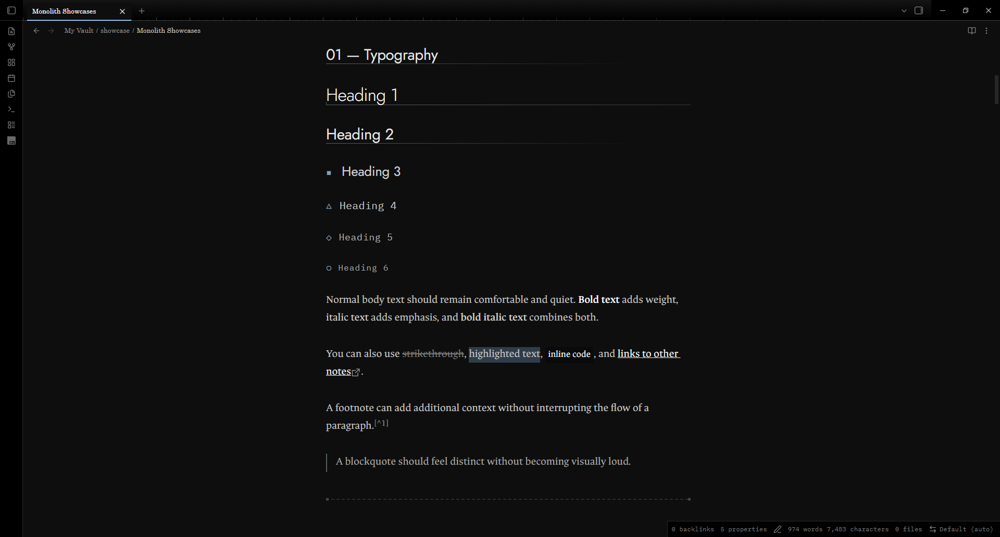
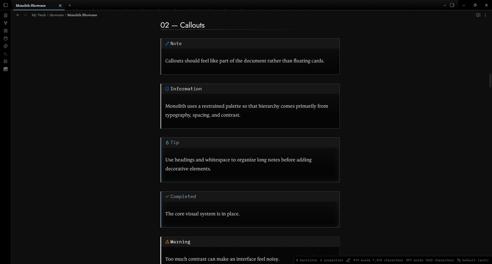
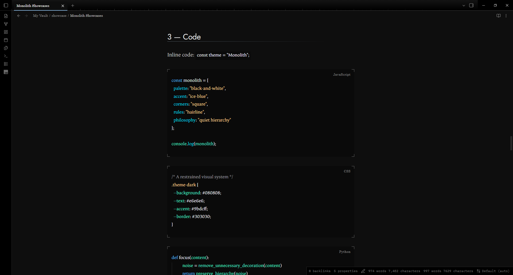
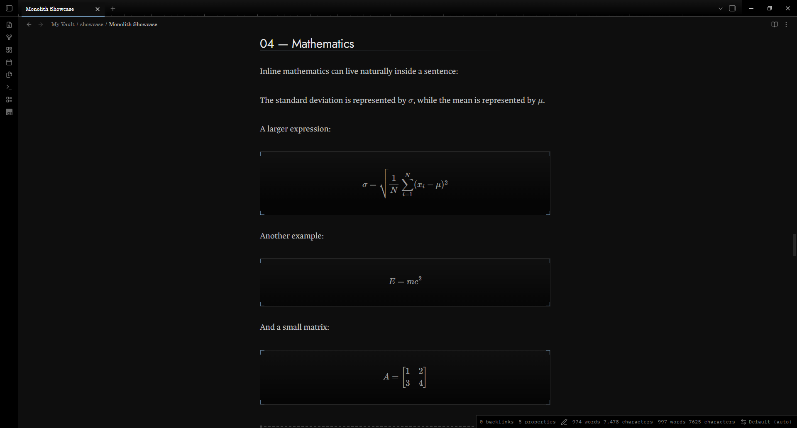

# Monolith

A minimal black-and-white Obsidian theme with a single ice-blue accent.

Monolith cuts visual noise and keeps the hierarchy. Fine rules, square corners, and layered greys give writing, reading, and organizing a clear structure.


## Features

- **Dark and light.** A near-black dark theme and a paper-and-ink light theme.
- **A ladder of greys.** Each heading level, bold, italic, link, and equation has its own shade, size, and weight.
- **One accent.** Ice blue marks what is active or interactive. It stays quiet at rest and warms on hover.
- **Quiet callout colors.** Callouts take a faint hue on the edge, icon and title, and keep their shapes: solid, dashed or hatched. One slider turns the color back to grey.
- **Quiet details.** Corner brackets frame code, equations, and properties. A ruler runs along the tab strip. H3 to H6 each carry a different marker shape.
- **Comfortable to read.** Softened contrast, generous line height, and a 700px line length.
- **Right-to-left aware.** Heading rules and markers mirror for Arabic and other right-to-left text.
- **Works offline.** The fonts are bundled inside the theme.

## A closer look

### Typography



### Callouts



### Code



### Mathematics



## Install

Monolith needs Obsidian 1.10.6 or newer.

1. Open **Settings**, then **Appearance**.
2. Under **Themes**, open the community theme browser and search for **Monolith**.
3. Install the theme and select it.

To install by hand, copy `manifest.json` and `theme.css` into `.obsidian/themes/Monolith/` inside your vault, then choose Monolith under Appearance. The folder name must match the theme name.

## Customize

Choose the accent color, text size, and fonts under **Settings**, then **Appearance**. Monolith follows your choices.

The optional Style Settings plugin adds six more options:

| Option | What it does |
| --- | --- |
| Plain headings | Removes heading rules and markers |
| Flat surfaces | Removes glows, corner brackets, and the tab ruler |
| Numbered tabs | Prefixes tabs with 01 /, 02 / and so on |
| Readable line width | Sets the width of a note |
| Accent strength | Scales the accent tints from 0 to 1 |
| Callout color | Scales the callout hues from 0 to 1 |

Without the plugin, a CSS snippet does the same job. For example, this softens the accent:

```css
body { --mn-accent-k: 0.6; }
```

And this turns callouts back to plain grey:

```css
body { --mn-callout-k: 0; }
```

## Sample note

[showcase/Monolith Showcase.md](showcase/Monolith%20Showcase.md) uses every element the theme styles: headings, lists, tasks, tables, code, math, callouts, and right-to-left text. Copy it into a vault to see Monolith at work.

## Design notes

[docs/design-notes.md](docs/design-notes.md) covers the full grey ladder, the contrast ratios, and the reasoning behind the accent.

## Credits and license

Monolith is released under the MIT license. It bundles two typefaces under the SIL Open Font License 1.1: Jost and IBM Plex Mono. The code colors adapt the [Houston theme for Visual Studio Code](https://github.com/withastro/houston-vscode), released under the MIT license by The Astro Technology Company. See [THIRD-PARTY-NOTICES.txt](THIRD-PARTY-NOTICES.txt).
