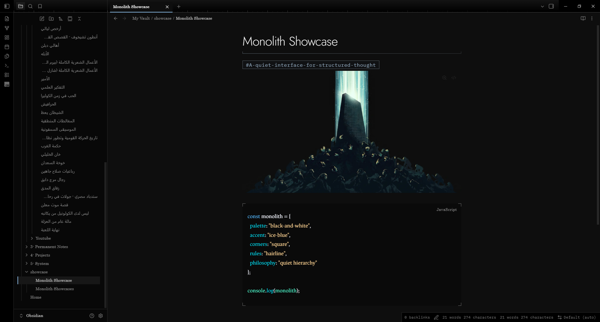

# Monolith

A calm black-and-white theme for Obsidian with a single ice-blue accent. Hairline rules, square corners and a ladder of greys give every heading, bold, italic, link and equation its own look.

## Features

- **Dark and light.** A near-black dark theme and a paper-and-ink light theme.
- **A ladder of greys.** Each heading level, bold, italic, link and equation has its own shade, size and weight.
- **One accent.** Ice blue marks what is active or interactive. It stays quiet at rest and warms on hover.
- **Quiet details.** Corner brackets frame code, equations and properties. A ruler runs along the tab strip. H3 to H6 each carry a different marker shape.
- **Comfortable to read.** Softened contrast, generous line height and a 700px line length.
- **Right-to-left aware.** Heading rules and markers mirror for Arabic and other right-to-left text.
- **Works offline.** The fonts are bundled inside the theme.

## Install

1. Open **Settings**, then **Appearance**.
2. Under **Themes**, open the community theme browser and search for **Monolith**.
3. Install the theme and select it.

To install by hand, copy `manifest.json` and `theme.css` into `<your vault>/.obsidian/themes/Monolith/`, then choose Monolith under **Appearance**. The folder name must match the theme name.

Monolith needs Obsidian 1.10.6 or newer.

## Customize

Choose the accent color, text size and fonts under **Settings, Appearance**. Monolith follows your choices.

The optional [Style Settings](https://github.com/mgmeyers/obsidian-style-settings) plugin adds five more options:

| Option | What it does |
| --- | --- |
| Plain headings | Removes heading rules and markers |
| Flat surfaces | Removes glows, corner brackets and the tab ruler |
| Numbered tabs | Prefixes tabs with `01 /`, `02 /` and so on |
| Readable line width | Sets the width of a note |
| Accent strength | Scales the accent tints from 0 to 1 |

Without the plugin, a CSS snippet does the same job. For example, `body { --mn-accent-k: 0.6; }` softens the accent.

## Sample note

[`showcase/Monolith Showcase.md`](./showcase/Monolith%20Showcase.md) uses every element the theme styles: headings, lists, tasks, tables, code, math, callouts and right-to-left text. Copy it into a vault to see Monolith at work.

## Design notes

The full grey ladder, contrast ratios and the reasoning behind the accent are in [docs/design-notes.md](./docs/design-notes.md).

## Credits and license

Monolith is released under the MIT license. It bundles two typefaces under the SIL Open Font License 1.1: Jost and IBM Plex Mono. See `THIRD-PARTY-NOTICES.txt`.
